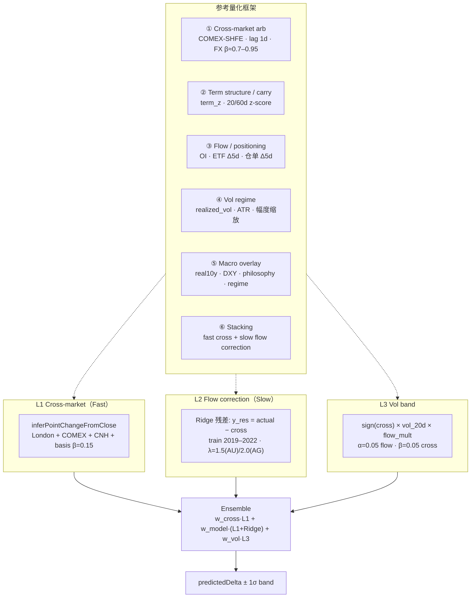

# 沪金/沪银每日点位预测模型（AU/AG Point Prediction）

Phase 1 · `v1.0-phase1` · 2026-06-14  
生产方向层不变：**v1.34.8-ag-cu-spread+basis-term**（本模型为**独立点位层**，不覆盖 logistic 方向权重）

---

## 1. 标签定义（CRITICAL）

```text
target_point_delta = close[t+1] - close[t]   # 元/克(AU) · 元/千克(AG)
```

- **数据源**：`history/trading/au.json` · `ag.json` 的 **`close`** 字段 — **非** settlement/settle
- **默认生产目标**：**T+1** — 每个交易日收盘后预测「明日收盘 − 今日收盘」
- **探针同时支持**：T+0 同日（`inferPointChangeFromClose` 跨境锚）与 T+1 ensemble
- **交易日历**：仅 SHFE 实际成交日；`bars[i]→bars[i+1]` 自动跳过休市

---

## 2. 架构（三层 Ensemble + 参考框架）



### 参考模型 → 本实现映射

| 框架 | 因子 | 参数 |
|------|------|------|
| **Cross-market arb** | `comex_overnight_pct`, `london_overnight_pct`, `cnh_chg_1d`, `premium_discount_pct`, `cross_point_delta` | lag 1d · basis β=0.15 · FX 离岸 CNH |
| **Term structure** | `term_spread_pct`, `term_z_score`, `term_spread_chg_5d`, `backwardation_flag`, `ag_cu_term_z_spread` | z-score 窗口 20/60d（flatRow） |
| **Flow / positioning** | `oi_*`, `gldHoldings_chg_5d`, `slvHoldings_chg_5d`, `warehouse_chg_5d` | Δ5d / Δ10d |
| **Vol regime** | `realized_vol_5/10/20d`, `high_vol_regime` | mean_abs 20d · regime 分窗（cross-vol） |
| **Macro** | `philosophyScore`, `real10y_chg_5d`, `regime_*` | philosophy AU×1 · AG×0.45 |
| **Ensemble** | Tier A/B/C 加权 | 网格搜索 w_cross/w_model/w_vol |

---

## 3. 因子表（完整）

实现：`services/precious-point-predictor-features.js`

| 层 | 因子 | 窗口/参数 |
|----|------|-----------|
| L0 | ret_1d/5d/20d | close-to-close % |
| L0 | realized_vol_5/10/20d | mean_abs 点位 |
| L0 | volume_chg_1d, volume_z_score_20d | 20d z |
| L0 | oi_change_pct, volume_oi_ratio, oi_divergence_rate_5d | OI 微观 |
| L1 | comex_overnight_pct, london_overnight_pct | 隔夜 % |
| L1 | cnh_chg_1d, cross_implied_point_pct, premium_discount_pct | 跨境 |
| L2 | term_spread_pct, term_z_score, term_spread_chg_5d | 20/60d |
| L2 | ag_cu_term_z_spread, backwardation_flag | AG 专用 |
| L3 | gldHoldings_chg_5d, slvHoldings_chg_5d | 5d Δ |
| L3 | warehouse_chg_5d, warehouse_z_score_20d | SHFE 仓单 |
| L4 | philosophyScore, real10y_chg_5d, regime_* | one-hot |
| L5 | high_vol_regime, event_day | vol p90 · event |
| Meta | cross_point_delta | Ridge stacking |

---

## 4. 公式层

```text
# L1 — Cross anchor（Tier A）
predicted_cross = Δ(COMEX/London→CNH implied) + β_basis × Δ(premium) × implied/100

# L2 — Ridge residual（Tier B）
y_train = close[t+1] - close[t] - predicted_cross
ridge_residual = Ridge(X_L0–L5 + cross_point_delta, y_train)
predicted_ridge = predicted_cross + ridge_residual

# L3 — Vol signed（Tier C）
flow_mult = 1 + 0.05×(|oi|+|vol/oi|+|wh|)/100 + 0.05×|comex_overnight|
predicted_vol = sign(cross) × realized_vol_20d × flow_mult

# Final ensemble
predictedDelta = w_cross·cross + w_model·ridge + w_vol·vol   # AU/AG 独立权重

# Band（L3 vol scaling）
bandLow/High = (close[t] + predictedDelta) ± realized_vol_20d
```

---

## 5. KPI 目标（Phase 1）

| 指标 | AU（元/克） | AG（元/千克） | 说明 |
|------|-------------|---------------|------|
| MAE aspirational | **< 3** | < 130 | 长期目标 |
| MAE Phase 1 gate | **< 4** | < 130 | 探针 gate |
| Beat cross-only | **< 3.74–4.62** | < 178 | 基线探针 |
| 方向 T+1 | > 58% | > 58% | sign hit |

**OOS 窗口**：2023-01-01 — 2026-12-31  
**训练窗口**：2019-01-01 — 2022-12-31

运行后 KPI 见 `_probe-precious-point-predictor-out.json` 与本文 §6。

---

## 6. Phase 1 OOS KPI

> 由 `node scripts/probe-precious-point-predictor.js` 生成 — 见探针输出更新本节。

| 模式 | AU MAE | AG MAE | AU dir% | AG dir% |
|------|--------|--------|---------|---------|
| Cross-only | — | — | — | — |
| Vol-only | — | — | — | — |
| Ridge-only | — | — | — | — |
| **Ensemble** | — | — | — | — |

---

## 7. 文件清单

| 路径 | 职责 |
|------|------|
| `docs/AU_AG_POINT_PREDICTION_MODEL.md` | 本文（设计 + KPI） |
| `docs/PRECIOUS_POINT_PREDICTOR.md` | 实现速查 |
| `services/precious-point-predictor-features.js` | 标签 + L0–L5 因子 |
| `services/precious-point-predictor.js` | L1/L2/L3 + ensemble 推理 |
| `scripts/train-precious-point-predictor.js` | 训练 2019–2022 |
| `scripts/probe-precious-point-predictor.js` | OOS 2023–2026 |
| `{DATA}/outlook-models/precious-point-weights-v1.json` | Ridge + ensemble 权重 |

**不覆盖**：`outlook-logistic-weights.json`

---

## 8. UI 位置

- **页面**：大宗走势 → 沪金/沪银卡片
- **区块**：「跨境传导」下方
- **文案**：`预测明日收盘相对今日收盘: +X.XX 元/克 · ±1σ … · 置信强/中/弱`
- **代码**：`commodity-outlook-engine.buildCrossMarketPreciousSignal` → `pointPrediction` · `src/app.js` `renderOutlookPointPredictionRow`

---

## 9. 训练 / 探针命令

```bash
FANCHENG_DATA_DRIVE=E NODE_OPTIONS=--max-old-space-size=8192 node scripts/train-precious-point-predictor.js
FANCHENG_DATA_DRIVE=E NODE_OPTIONS=--max-old-space-size=8192 node scripts/probe-precious-point-predictor.js
```

---

## 10. 路线图（Phase 2–4）

### Phase 2 — Regime + Live 因子
- 分 regime 独立 ensemble 权重（event/trend/basis/range）
- UI 路径注入完整 flatRow（philosophy · OI · term · 仓单）
- T+0 同日 open-to-close 探针（若有 open）

### Phase 3 — 区间校准
- Conformal / quantile 带替代裸 ±1σ
- AG 专用 head（SLV + ag_cu_term_z 强化）
- 与 cross-vol regime window 统一

### Phase 4 — 生产化
- 每日自动重训 cron · 权重版本化
- 与 logistic 方向层 confidence gate 联动
- asar 部署 + 监控 MAE drift

---

## 11. 别名脚本（兼容用户 spec）

| 用户 spec | 实际路径 |
|-----------|----------|
| `train-precious-point-model.js` | `scripts/train-precious-point-predictor.js` |
| `probe-precious-point-model.js` | `scripts/probe-precious-point-predictor.js` |
| `services/au-ag-point-predictor.js` | `services/precious-point-predictor.js` |
