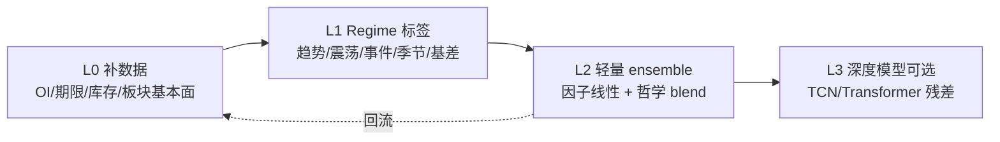

# 梵澄金融 · 架构反思（命中率天花板与演进路线）

> **版本**：v0.1 · **生成**：2026-06-12  
> **背景**：longrun v1.32.3 全量 overall **55–56%**，距 sector_balanced ≥70% 差 **14–15pp**；用户暂停回测，先做架构反思。  
> **配套**：`docs/FANCHENG_DATA_LAYER_BLUEPRINT.md`（数据层蓝图）、`docs/FANCHENG_LOGIC_FRAMEWORK.md`（研判逻辑）  
> **数据根**：`FANCHENG_DATA_DRIVE=E` → `E:\FanchengFinance\data`

---

## A. 当前架构能力与天花板

### A.1 已实现能力（六层哲学栈）

| 层级 | 能力 | 成熟度 |
|------|------|--------|
| L0 数据 | 75 合约日 K（`history/trading`）、74 套 klines、10 项 FRED、PMI、CNH/伦敦金、367 行 news-tagged | **中** — 缺仓单/期限结构/板块基本面 |
| L1 事件 | `classifyNewsArchetype`、刺激衰减、era 分段 | **高** |
| L2 哲学 | priced_in、农产品 yield、趋势台阶、剧震相位、历史锲合 | **高** — 规则丰富但输入稀疏 |
| L3 跨资产 | `classifyCrossAssetRegime`、AU overlay | **中** — 2026 脱钩已补丁 |
| L4 评分 | compositeScore + profile 权重 + directionTier | **中** |
| L5 校准 | epoch 网格 + adaptive 安全补丁 | **中** — 有过拟合风险 |
| L6 KPI | walk-forward T+1 方向命中率 | **高** — 计分口径统一 |

### A.2 命中率天花板（诚实估计）

在 **不补数据、不调标签** 的前提下，纯哲学/权重迭代预计天花板约 **58–62%** overall：

- 新闻标注已覆盖 2019–2026，但 **日频稀疏**（367 行 / 约 1900 交易日 ≈ 0.2 条/日）
- `inventory` 因子多依赖 K 线附带 OI（74 品种中约 55 满覆盖、5 几乎无 OI）
- 无 LME/港口库存、无期限结构 → 有色/黑色/能化 **主矛盾识别弱**
- 单一 composite + 阈值方向 → 震荡市与事件市 **同权处理**

**结论**：架构反思与数据蓝图一致认为——**下一档胜率（+8–15pp）应来自 L0 补数 + 标签分层，而非换网络。**

---

## B. 成功率低的根因（按贡献排序）

| 排序 | 根因 | 估计贡献 | 证据 |
|------|------|----------|------|
| 1 | **基本面/库存/期限结构缺失** | **+8–12pp 潜力** | 有色 inventory 权重高但无 LME 序列；黑色无港存/开工 |
| 2 | **新闻日频稀疏 + 2025_2026 事件密度仍不足** | **+4–6pp** | tagged 82+84 行/年，但 many days 零新闻；快讯 inbox ≠ 标注库 |
| 3 | **标签与哲学时间尺度不匹配** | **+3–5pp** | KPI 统一 T+1 方向；shock 应 T+1~T+5、叙事应 T+20~T+60 |
| 4 | **单一评分 + 固定阈值** | **+2–4pp** | 无显式「趋势/震荡/事件/季节/基差」regime 门控 |
| 5 | **Probe vs longrun 样本不一致** | **+1–2pp 假象** | probe 锚点日 vs 全量 walk-forward 方差大 |
| 6 | **板块 epoch 网格过拟合** | **负向 −1~3pp** | 2025_2026 gate 已下调；继续 longrun 风险过拟合 |
| 7 | **规则哲学 vs 学习模型** | **次要** | 规则可解释性强；瓶颈在输入而非公式复杂度 |

---

## C. Claude 建议的 regime+ensemble 与现有哲学映射

| Claude 建议 | 梵澄现有对应 | 差距 |
|-------------|--------------|------|
| **趋势市** | `trendStructureAnalyzer`、MA 排列、台阶突破 | 有规则，缺 regime **标签列** 用于 KPI 分桶 |
| **震荡市** | BOLL 带宽、`directionTier` 观望 | 未作为一级 regime 切换权重 |
| **高波动事件市** | `shock_event`、`postShockPhase`、刺激衰减 | 强；缺事件窗口专用标签 |
| **季节性主导市** | 农产品季节权重、epoch | 弱结构化；无种植/收割日历数据 |
| **基差修复市** | 无 | **完全缺失** — 需期限结构 + 升贴水 |
| **OLS/LASSO 因子** | `factorWeights` + 手工 composite | 可视为线性因子，未单独训练 |
| **XGBoost/LightGBM** | 无 | L2 可选；Electron 侧宜 ONNX/导出分数 |
| **LSTM/TCN** | 无 | L3 可选；非 P0 |
| **融合层 regime 权重** | `epochWeights` + `performanceGate` | 按 **时代** 而非 **日度 market regime** |

**映射结论**：梵澄已有 **哲学层 regime 的 60% 语义**（事件/叙事/剧震/跨资产），缺的是 **(a) 结构化行情 regime 标签** 与 **(b) 基本面数据驱动的 supply/demand 状态**。ensemble 应是 **哲学分 + 因子分 + 可选 ML 残差** 的加权，而非替换规则。

---

## D. 分阶段演进路线（不推翻现有）

| 阶段 | 周期 | 产出 | 预期 +pp |
|------|------|------|----------|
| **L0 数据** | 周 1–8 | `FANCHENG_DATA_LAYER_BLUEPRINT.md` 落地 | +8–15 |
| **L1 Regime 标签** | 周 9–10 | `labels/regime-daily.csv`、事件窗口列 | +2–4 |
| **L2 轻量 ensemble** | 周 11–14 | regime 条件化 φ/阈值；可选 LASSO 权重建议 | +2–5 |
| **L3 深度模型** | 可选 | 离线训练 → 导出分数 JSON | +0–3 |

---

## E. 短期仍可做 vs 必须重构

### 短期仍可做（不动核心架构）

- 跑通 OI 全品种回填、`history/oi/` 独立序列
- 期限结构 / 仓单 / LME 库存 fetcher（见蓝图 P0）
- 扩展 news-tagged 2025_2026 锚点 + flash 合并核验
- 标签 schema：主 KPI T+1 + 副 KPI 事件窗口
- Regime 日标签（由现有技术指标 + 波动率规则生成，零 ML）

### 必须重构或新增模块（中期）

- `commodity-outlook-backtest.js`：**多标签计分**（非仅 T+1 方向）
- 基本面因子管道：`sector-fundamentals-loader.js` 按板块注入 `inventoryScore` / `basisScore`
- 显式 **基差修复 regime**（依赖期限结构数据）
- 若做 ML：独立 `training/` 管道，运行时只读 **预计算分数**

### 不应做（当前阶段）

- 盲目 longrun 调 sector 网格
- Electron 内嵌 PyTorch / 实时训练
- 用 inbox 快讯条数替代 news-tagged 权威库

---

## F. 三个架构方向问题（请用户确认）

1. **Regime 优先级**：下一版是否将 Claude 五类 regime（趋势/震荡/事件/季节/基差）固化为 **日标签 + KPI 分桶**，还是先只做「事件市 vs 非事件市」两档？

2. **ensemble 边界**：轻量 ensemble 是否限定为 **哲学分 × regime 权重 + 现有因子分**（无新 ML），还是允许离线 XGBoost 产出 `ml_residual_score.json` 供引擎读取？

3. **数据 vs 标注预算**：未来 12 周，您更愿意把主要精力放在 **(A) 板块基本面自动抓取** 还是 **(B) 手工标注高密度新闻/政策日**？（两者互补，但决定 P0 人力分配）

---

## 与数据蓝图的衔接

本反思文档侧重 **为何卡在 56%** 与 **架构演进**；具体字段、路径、P0 缺口与 12 周数据路线图见 **`docs/FANCHENG_DATA_LAYER_BLUEPRINT.md`**。

**当前状态**：longrun **已暂停**（见 `_longrun-v1323-paused.txt`），待用户确认架构与数据 P0 后再恢复回测。
