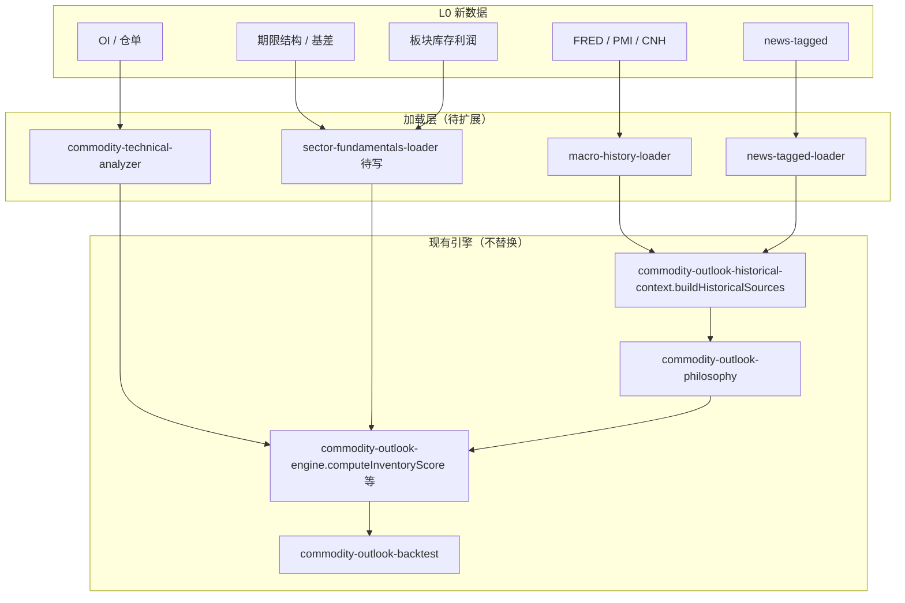

# 梵澄金融 · 四层数据架构蓝图

> **版本**：v0.2 · **更新**：2026-06-12（用户 P0 决策 29bc9f94）  
> **原则**：**70% 胜率提升来自数据工程 + 标签设计，而非更复杂的网络。**  
> **配套**：`docs/FANCHENG_ARCHITECTURE_REFLECTION.md`、`docs/FANCHENG_LOGIC_FRAMEWORK.md`、`docs/FANCHENG_V134_ROADMAP.md`  
> **数据根**：`FANCHENG_DATA_DRIVE=E` → `E:\FanchengFinance\data`  
> **审计基准日**：2026-06-12（E 盘实扫 + OI 回填后复检）

---

## 一、用户原则（数据 > 模型）

1. **价格 = 供需 × 金融环境** — 数据层须同时覆盖 **盘面行为**（L1）与 **现货/库存**（L2），宏观（L3）与另类（L4）作门控与事件触发，而非替代主矛盾。
2. **标签双轨** — **主 KPI = T+3 趋势方向**（`computeT3TrendLabel`）；**对比轨 = T+1**（`computeT1Direction`）保留与 v1.32 longrun 可比。shock 看 T+1~T+5，叙事看 T+20~T+60。
3. **P0 市场 = OI + 行为** — 增仓下跌、减仓上涨、成交持仓比；由 `oi-behavior-features.js` 从 OI 日频派生。
4. **P0 板块基本面 = 贵金属** — real10y、伦敦金、CNH 溢价（T+3 KPI 对齐）、ETF stub（GLD 代理路径已文档化）。
5. **规则引擎优先** — 新数据 **喂给** `commodity-outlook-philosophy` / M1 子模型（权重 20–30%），Phase 3 才允许 ONNX。
6. **longrun 暂停** — Phase 0–2 完成前禁止 `tune-sector-weights-longrun` 并行网格。
7. **权威库单一真相** — walk-forward 新闻只认 `news-tagged.csv`；`flash-news-inbox.json` 须 merge 核验。
8. **时代最差优先补数** — `2025_2026` era 按 **贵金属 + 有色 + 能化** 最差板块优先。

### 四层覆盖率快照（2019+ 口径，粗估）

| 支柱 | 覆盖度 | 说明 |
|------|--------|------|
| **1 市场数据** | **~52%** | OHLCV 齐全；OI **68/74 ≥80%**（KPI 核心品种；低覆盖 6 品种 LR/JR/PM/RI/WH/ZC 排除分母）；行为因子已实现待接入引擎 |
| **2 现货基本面** | **~18%** | 油价/伦敦金/部分宏观代理；板块库存利润几乎无 |
| **3 宏观政策** | **~62%** | FRED+PMI+CNH+新闻较全；中国下游/社融/政策事件表不全 |
| **4 另类数据** | **~38%** | 新闻+快讯有；航运/卫星/天气/高频报价弱 |

---

## 二、四层数据架构（字段审计表）

**图例**：✅ 有 · ⚠️ 部分 · ❌ 无  
**路径前缀**：`E:\FanchengFinance\data\`（下表省略此前缀）

### 2.1 第一层：市场数据

| 字段 / 指标 | 梵澄现状 | 板块 | 优先级 | 获取方式 |
|-------------|----------|------|--------|----------|
| 连续合约日 K（开高低收） | ✅ `history/trading/{id}.json`（75 文件，主力 2017–2026）；✅ `klines/commodity-{id}-day.json`（74 套） | 全板块 | P0 | 已有：新浪/东财 + tick 转换 |
| 结算价 | ⚠️ 部分品种 `close` 代理结算 | 全板块 | P1 | 交易所日行情结算价字段 |
| 成交量 | ✅ `volume` | 全板块 | — | 已有 |
| 持仓量 OI | ⚠️ trading：**回填前** 64/74 ≥80%，**4/74 零覆盖**（au/ag/fu/sc）；**回填后** **68/74 ≥80%**，**0 零覆盖**；6 品种部分覆盖（JR/LR/PM/RI/WH/ZC）；klines 待 `backfill-commodity-oi` | 全板块 | **P0** | `scripts/backfill-oi-missing.js`（trading 四品种）；`npm run backfill-commodity-oi`（klines） |
| 主力 / 次主力 / 远月合约价 | ❌ 仅主连 | 全板块 | P1 | 东财多 `secid`；`scripts/fetch-term-structure.js`（stub） |
| 注册仓单 / 仓单变化 | ⚠️ **cu 官方 1567 + MM 稀疏补洞** | 有色/农产品/化工 | **P0** | `fetch-warehouse-receipts.js --scrape` + `--import` 合并；见附录 C |
| 近月-远月价差、跨期斜率 | ⚠️ **P0 首版** `fetch-term-structure.js`（trading+Sina 远月）→ `term-structure/{id}-daily.json` | 全板块 | **P0** | au/sc/cu 已接 flatRow + basis regime |
| 升贴水（期现基差） | ❌ | 有色/黑色/农产品 | **P0** | 现货价（生意社）− 期货主力；与期限结构合并 |
| 成交持仓比、换手率 | ✅ `oi-behavior-features.js` → `volume_oi_ratio` | 全板块 | **P0** | 日频派生；待写入 trading 或回测 flatRows |
| 增仓下跌 / 减仓上涨等行为 | ✅ `price_down_oi_up` / `price_up_oi_down` + `behavior_tag` | 黑色/有色/能化/贵金属 | **P0** | OI 补齐后规则打标；接入 `commodity-technical-analyzer` |

### 2.2 第二层：现货与基本面

| 字段 / 指标 | 梵澄现状 | 板块 | 优先级 | 获取方式 |
|-------------|----------|------|--------|----------|
| 铁矿港口库存 | ❌ | 黑色 | **P0** | Mysteel/生意社 CSV；`fetch-sector-fundamentals.js` |
| 焦煤焦炭库存 | ❌ | 黑色 | P0 | 同上 |
| 高炉开工、螺纹表需 | ❌ | 黑色 | P1 | 周度→日频前填 |
| 钢厂利润 | ❌ | 黑色 | P1 | 公式：成品−原料 |
| LME/COMEX/SHFE 库存 | ❌ 待用户 CSV | 有色 | **P0** | `fetch-lme-shfe-inventory.js --import`；见蓝图附录 B.3 |
| 有色升贴水、进口盈亏 | ❌ | 有色 | P0 | SMM/海关+期货 |
| 冶炼利润、废金属替代 | ❌ | 有色 | P2 | 周度行业数据 |
| 原油（WTI/Brent） | ✅ `history/fred-wti-daily.json`、`fred-brent-daily.json` | 能化 | — | FRED 已有 |
| 裂解价差、煤化工利润 | ❌ | 能化 | P0 | 原油+化工品价差序列 |
| 炼厂开工、港口油品库存 | ❌ | 能化 | P0 | 隆众/生意社 |
| 装置检修日历 | ❌ | 能化/化工 | P1 | 事件表 CSV |
| 天气、种植面积 | ❌ | 农产品 | P1 | 气象局/USDA；`history/weather/` |
| 压榨利润、养殖利润 | ❌ | 农产品 | P1 | 油厂/饲料价差 |
| 进口到港、库存去化 | ❌ | 农产品 | P1 | 海关+港口 CSV |
| 美元、实际利率 | ✅ `fred-real10y-daily.json` | 贵金属 | **P0** | FRED · `precious-sector-loader.js` |
| 伦敦金 | ✅ `fred-london-gold-daily.json`（1923 行 2019+） | 贵金属 | **P0** | FRED · `computeAuSpotCnhOverlay` |
| CNH / 汇率 | ✅ `cnh-midrate-daily.json`（1938 行）；回退 `fred-dexchus-daily.json` | 贵金属 | **P0** | `fetch-cnh-midrate.js` · 沪金溢价 T+3 KPI |
| ETF 持仓、地缘风险指数 | ⚠️ **stub** `precious-etf-holdings-daily.json`（待写）；代理 **GLD/IAU**；**手动**：SPDR 区域页 Historical Archive XLSX（`usa/gld` · `japan/gld` · `hong-kong/2840`）→ 转 `date,tonnes` CSV → `user-gld-holdings.csv` → `--import`（**勿用** `GLD_US_archive_EN.csv`，已 301 至 barlist 当日 bar） | 贵金属 | **P0 stub** | `services/precious-etf-fetcher.js` · `precious-sector-loader.js` |

### 2.3 第三层：宏观与政策

| 字段 / 指标 | 梵澄现状 | 板块 | 优先级 | 获取方式 |
|-------------|----------|------|--------|----------|
| 联邦基金利率 DFF | ✅ `fred-dff-daily.json` | 全板块 | — | `fred-history-fetcher.js` |
| VIX | ✅ `fred-vixcls-daily.json` | 全板块 | — | 已有 |
| M2 | ✅ `fred-m2sl-monthly.json`（月→日频前填） | 全板块 | — | 已有 |
| 10Y 实际利率 | ✅ `fred-real10y-daily.json` | 贵金属/宏观 | — | 已有 |
| 美元指数 / 人民币汇率 | ✅ `fred-dxy-daily.json`、`fred-dexchus-daily.json` | 全板块 | — | 已有 |
| 中美 PMI | ✅ `macro-pmi-monthly.json`（cn/us/ez） | 黑色/有色/化工 | — | `macro-history-loader.js` |
| 中国 PPI/CPI/社融/工业增加值 | ⚠️ 运行时 macro-fetcher 有 CPI 等；**历史 walk-forward 序列不全** | 黑色/化工 | P1 | 扩展 `history/china-macro-monthly.csv` |
| 地产/基建/汽车销量 | ❌ | 黑色/有色 | P1 | 国家统计局月频 CSV |
| 关税/出口/收储抛储 | ⚠️ 部分在 `news-tagged`；无独立事件表 | 全板块 | P1 | `history/events/policy-export.csv` |
| 交易所风控调整 | ⚠️ 新闻 sporadic | 全板块 | P2 | 公告抓取+标注 |
| 内置时代日历 | ✅ `commodity-outlook-event-calendar.js` | 全板块 | — | 代码内置 |

### 2.4 第四层：另类数据

| 字段 / 指标 | 梵澄现状 | 板块 | 优先级 | 获取方式 |
|-------------|----------|------|--------|----------|
| 按日标注新闻/政策 | ✅ `history/news-tagged.csv`（**994 行**；flash merge 后）；2025/2026 待 hygiene 分年统计 | 全板块 | P0（续标） | 用户 batch + `merge-all-user-news-final.js` + `merge-flash-into-news.js` |
| 快讯候选池 | ✅ `flash-news-inbox.json` + `fetch-flash-news.js` | 全板块 | P1 | 须合并核验，非权威库 |
| 用户 AU 锚点 | ✅ `user-au-events-batch1~5.csv`（28 事件） | 贵金属 | P0（续并） | merge 进 news-tagged |
| 航运指数（BDI 等） | ❌ | 能化/黑色 | P2 | FRED/克拉克森 |
| 电厂日耗 | ❌ | 能化/黑色 | P2 | 高频行业数据 |
| 卫星/遥感 | ❌ | 农产品/能化 | P2 | 第三方 API |
| 产业链高频报价 | ⚠️ 生意社实时资讯，**无历史序列** | 全板块 | P1 | 侧脚本日度落盘 |
| 新闻情绪分 | ❌ | 全板块 | P2 | 标注 direction 已够 P0 |

### 2.5 现有 `history/trading/*.json` 结构说明

- **格式**：JSON **数组**，每元素为日 bar，非 `{ series: [...] }` 包装。
- **字段**（以 `au.json` 为例）：`date, open, high, low, close, price, volume, oi, openInterest`。
- **范围**：2017-12-11 → 2026-06-08，约 2057 根/主力品种。
- **短板**：`pt/pd` 仅 19 根；`ad/br/ec` 等 <500 根；与 walk-forward 主样本一致但 **缺次主力/远月**。

### 2.6 P0 stub 脚本清单（已实现占位）

| 脚本 | 目标路径 |
|------|----------|
| `scripts/fetch-warehouse-receipts.js` | `history/warehouse-receipts/{id}-daily.json` |
| `scripts/fetch-term-structure.js` | `history/term-structure/{id}-daily.json`（**au/sc/cu 已落地**） |
| `services/term-structure-fetcher.js` | 抓取 + `getTermStructureAtDate` · flatRow 接线 |
| `scripts/fetch-lme-shfe-inventory.js` | `history/inventory/{metal}-weekly.json` |
| `scripts/fetch-sector-fundamentals.js` | `history/sector-fundamentals/{sector}-{metric}-weekly.json` |
| 已有 `scripts/backfill-commodity-oi.js` | klines `openInterest` + 可选 `history/oi/` |
| `scripts/backfill-oi-missing.js` | trading JSON 四零覆盖品种（au/ag/fu/sc）+ `--partial` |
| `services/precious-sector-loader.js` | 贵金属 P0 路径聚合 + ETF stub 文档 |
| `services/oi-behavior-features.js` | OI 行为因子派生 |

---

## 三、标签设计（双轨：T+3 主 KPI + T+1 对比）

### 3.1 推荐主标签 schema（`data/history/labels/direction-daily.csv`）

| 列名 | 类型 | 说明 |
|------|------|------|
| `date` | YYYY-MM-DD | 信号日 T |
| `instrument_id` | string | 合约 id |
| `label_primary` | bullish/bearish/neutral | **主 KPI**：T+3 趋势方向（`computeT3TrendLabel`） |
| `return_t3_pct` | float | `(close[T+3]-close[T])/close[T]*100` |
| `label_compare` | bullish/bearish/neutral | **对比轨**：T+1 方向（`computeT1Direction`） |
| `return_t1_pct` | float | `(close[T+1]-close[T])/close[T]*100` |
| `label_tier` | strong_bull/bull/neutral/bear/strong_bear | 按 `DIRECTION_THRESHOLDS[volTier]` 分档 |
| `label_quantile` | int 0–4 | 同品种滚动 252 日收益分位（**副标签**，防震荡市噪声） |
| `era_id` | string | `2025_2026` 等，与回测 era 对齐 |
| `event_window` | shock_t1/shock_t5/narrative_t20/none | 与 `classifyNewsArchetype` 对齐 |
| `priced_in_flag` | 0/1 | T-5~T 预涨且事件日 → priced_in 观察 |
| `regime_tag` | trend/chop/event/seasonal/basis | 行情 regime（L1 目标） |
| `exclude_kpi` | 0/1 | 低流动性 pt/pd/wr 等 |

### 3.2 三套标签的分工

| 标签类型 | 用途 | 与哲学关系 |
|----------|------|------------|
| **T+3 趋势**（`label_primary`） | **主 KPI**、Phase 3 ensemble 训练 | 与 M1 叙事/shock 时间尺度一致 |
| **T+1 方向**（`label_compare`） | 对比轨、与 v1.32 longrun 可比 | 保留，非优化目标 |
| **收益分位**（`label_quantile`） | 过滤「微小波动」假信号 | 阈值中性日不纳入 strict KPI |
| **事件窗口**（`event_window`） | shock/narrative 分桶命中率 | priced_in 用 shock_t1；叙事延长用 narrative_t20 |

### 3.3 priced_in 专用子标签

对 `macro_repeat` / FOMC / 降息类事件：

- `pre_move_5d_pct`：T-5→T 收益
- `label_priced_in_t1`：若 `pre_move_5d_pct > sector_vol` 且 `return_t1_pct` 反向 → **priced_in 命中**
- **2025_2026 AU**：`label_priced_in_t1` 计「观望 neutral 是否正确」，**不强制 bearish flip**（与用户 era_split 一致）

### 3.4 生成管道（建议，不训练 ML）

```
history/trading/*.json + news-tagged.csv + event-calendar
  → services/outlook-labels.js（computeDualLabels）
  → scripts/build-direction-labels.js（待写）
  → history/labels/direction-daily.csv
  → commodity-outlook-backtest 多 KPI 报表（T+3 主 / T+1 对比）
```

**标签推荐（一段话）**：以 **T+3 趋势为主 KPI**（阈值 ±0.05%），同步保留 **T+1 对比轨** 与 252 日收益分位、event_window 分桶；shock 事件在 KPI 中改用 **T+1~T+5 窗口命中率**，叙事主题用 **T+20~T+60**，priced_in 单独用「T-5 预涨 + T+1 兑现/反转」子标签。AU 2023–2026 简单 5 日动量基线：T+3 命中率 **52.11%** vs T+1 **50.62%**（+1.49pp），T+3 中性日更少，更适合趋势型 KPI。

---

## 四、与现有 philosophy 引擎的接口（数据喂给规则，不是替换）



| 数据 | 注入点 | 字段/函数 |
|------|--------|-----------|
| OI 日变化 | `commodity-technical-analyzer` → `oi.score` | `inventoryScore` 权重 |
| LME/港口库存 | 新建 loader → `computeInventoryScore` | 替代纯 OI 代理 |
| 期限结构 / 基差 | `assessBasisRegime`（待写）→ philosophy | 「基差修复市」regime |
| 裂解/钢厂利润 | `sector-fundamentals-loader` | 板块 `supplyDemand` 矩阵输入 |
| PMI / 实际利率 | `macro-history-loader` | `buildMacroScoresForInstrument` |
| 新闻行 | `news-tagged-loader` | `applyItemStimulusWeight`、`classifyNewsArchetype` |
| 伦敦金 + CNH | `historical-context` | AU `computeAuSpotCnhOverlay`（实盘；回测默认 skip） |
| 跨资产 | `commodity-cross-asset-regime` | SP500/VIX/油金 条件化 |

**原则**：新因子只改 **输入向量** 与 **regime 门控**；`assessPricedInVsPanic`、`eventStimulusDecay` 等规则函数保持不变。

---

## 五、12 周数据工程路线图

**目标**：在不跑 longrun 的前 8 周专注补数 + 标签；第 9 周起用户确认后再回测。

| 周次 | 任务 | 产出 | 板块/时代 |
|------|------|------|-----------|
| **W1–2** | OI 回填：**trading 4 零覆盖已补**；6 部分品种 `--partial`；klines `--force` | trading **68/74 ≥80%** → 目标 74/74 | 全板块 P0 |
| **W2–3** | 期限结构 stub → 东财近远月价差（CU/AL/SC/RB 先行） | `term-structure/*.json` | 有色/能化/黑色 P0 |
| **W3–4** | LME 铜铝锌库存周度 CSV 导入 + loader | `inventory/*.json` | 有色 P0 |
| **W4–5** | 仓单：上期所铜铝 + 农产品首批 | `warehouse-receipts/` | 有色/农产品 P0 |
| **W5–6** | 黑色：铁矿港存 + 高炉开工（用户 CSV 或 Mysteel） | `sector-fundamentals/black-*` | 黑色 P0 |
| **W6–7** | 能化：裂解价差 + 港口库存 | `sector-fundamentals/energy-*` | 能化 P0 |
| **W7–8** | news-tagged 2025_2026 高密度补标 + AU batch 并入 | tagged ≥450 行 | 2025_2026 P0 |
| **W8** | `build-direction-labels.js` + 多 KPI 标签文件 | `labels/direction-daily.csv` | 标签 P0 |
| **W9–10** | `sector-fundamentals-loader` + `basisScore` 接入引擎 | 引擎读新因子 | 接口 |
| **W10–11** | Regime 日标签（技术规则，无 ML） | `labels/regime-daily.csv` | L1 |
| **W11–12** | 文档 + 数据 hygiene 复检；**用户确认后**恢复 longrun | `fetch-summary.json` 更新 | 验收 |

**2025_2026 最差 era 优先品种**：AU/AG（priced_in）、CU（叙事+库存）、SC（地缘+裂解）、RB/I（港存+宏观）。

---

## 六、OI 覆盖审计（2026-06-12）

| 口径 | 回填前 | 回填后（计划完成） |
|------|--------|-------------------|
| trading ≥80% | **64/74** | **68/74** |
| 零 OI 品种 | **4**（au, ag, fu, sc） | **0** |
| 部分覆盖 | 6（JR, LR, PM, RI, WH, ZC） | 6 → `--partial` 待补 |
| 行为因子 | 未固化 | `oi-behavior-features.js` 已实现 |

**下一步 OI**：`backfill-oi-missing.js --partial` + `backfill-commodity-oi --force` 同步 klines。

---

## 七、用户已确认（2026-06-12）

1. **P0 市场**：OI + 行为因子（增仓下跌/减仓上涨/成交持仓比）
2. **P0 板块基本面**：贵金属（ETF stub、real10y、伦敦金、CNH 溢价）
3. **标签**：双轨 — 主 KPI **T+3**，保留 **T+1** 对比
4. **哲学**：M1 子模型 20–30%；ONNX Phase 3 允许
5. **longrun**：暂停至 Phase 2 完成

---

## 附录 A：longrun 状态

- **`_longrun-v1323-paused.txt`**：已记录多次断电/用户暂停；**2026-06-12 用户选择 wait**，继续补 P0 结构数据（期限结构 / 仓单 / 库存），**暂不恢复 longrun、暂不 GLD pilot**。
- 恢复前须：用户确认本蓝图 P0 + 架构反思 F 节三问。

---

## 附录 B：P0 手动 CSV 模板（用户下载 / 导入）

数据根：`E:\FanchengFinance\data\history\`（`FANCHENG_DATA_DRIVE=E`）

### B.1 期限结构（自动 + 可选手工补洞）

| 项 | 说明 |
|----|------|
| **自动抓取** | `FANCHENG_DATA_DRIVE=E node scripts/fetch-term-structure.js [--force]` |
| **逻辑** | 主力连续 `history/trading/{id}.json` 收盘价 − Sina 远月单合约（约 +3 月） |
| **P0 品种** | `au` · `sc` · `cu` |
| **落盘** | `history/term-structure/{id}-daily.json` |
| **字段** | `date, near_contract, far_contract, spread_near_far, spread_pct, z_score, structure_regime` |
| **手工补洞**（可选） | 若 Sina 某远月缺失，可建 `user-{id}-term-structure.csv` 后合并（列同上），待 loader 扩展 |

### B.2 注册仓单（SHFE/DCE/CZCE）

**模板列**（保存为 UTF-8 CSV，首行表头）：

```csv
date,warehouse_receipt,change_dod,exchange
2025-01-02,12345,-120,SHFE
2025-01-03,12280,-65,SHFE
```

| 项 | 说明 |
|----|------|
| **建议文件名** | `E:\FanchengFinance\data\history\user-cu-warehouse.csv`（按品种替换 `cu`→`al`/`rb` 等） |
| **导入命令** | `FANCHENG_DATA_DRIVE=E node scripts/fetch-warehouse-receipts.js --import E:\FanchengFinance\data\history\user-cu-warehouse.csv --id cu` |
| **落盘** | `history/warehouse-receipts/{id}-daily.json` |
| **数据来源** | [上期所仓单日报](https://www.shfe.com.cn/reports/tradedata/dailyandweeklydata/) · 大商所 · 郑商所（导出或手工整理） |

### B.3 LME / SHFE 有色库存（周频）

**模板列**：

```csv
week_ending,inventory_tonnes,change_wow,source
2025-01-03,123456,-2340,LME
2025-01-10,121116,-2340,LME
```

| 项 | 说明 |
|----|------|
| **建议文件名** | `E:\FanchengFinance\data\history\user-lme-copper.csv`（`copper`/`aluminum`/`zinc`/`nickel`/`lead`/`tin`） |
| **导入命令** | `FANCHENG_DATA_DRIVE=E node scripts/fetch-lme-shfe-inventory.js --import E:\FanchengFinance\data\history\user-lme-copper.csv --metal copper` |
| **落盘** | `history/inventory/{metal}-weekly.json` |
| **数据来源** | [LME 公开库存](https://www.lme.com/en/Market-Data/Reports-and-data/Reports) · 东方财富有色库存 · 生意社（导出 CSV） |

### B.4 GLD ETF（贵金属 P0）

见 §2.2 贵金属 ETF。**首选** SPDR Historical Archive 直接 API（XLSX）：

| 区域 | 直接 API |
|------|----------|
| US (GLD) | `https://api.spdrgoldshares.com/api/v1/historical-archive?product=gld&exchange=NYSE&lang=en` |
| HK (2840) | `https://api.spdrgoldshares.com/api/v1/historical-archive?product=2840&exchange=HKeX` |
| JP (1326) | `https://api.spdrgoldshares.com/api/v1/historical-archive?product=1326&exchange=TSE` |

备选：各区域 SPDR 页下滑至 **Historical Data → Historical Archive (XLSX) → Download**（`usa/gld` · `japan/gld` · `hong-kong/2840`）。转为 `date,tonnes` CSV → `fetch-precious-etf-holdings.js --import`（**勿用** `GLD_US_archive_EN.csv`，已 301 至 barlist 当日 bar，非历史 tonnes）。

---

## 附录 C：稀疏 vs 官方数据质量（2026-06-12 dd421671）

MacroMicro Business CSV 导出为 **季度/月度稀疏锚点**（约 49 行/系列），**不可替代**日频/周频官方序列。导入逻辑：**官方优先、稀疏仅补洞**。

| 序列 | 官方（主） | 稀疏 MM（补洞） | 合并策略 | 当前 E 盘状态 |
|------|-----------|----------------|----------|---------------|
| **SHFE 铜仓单** | `shfe-official` 抓取 **1567 行**（2019-01-02→2025-11-17） | `user-cu-warehouse.csv` **+20 行** | `mergeWarehouseRows`：同日期 `shfe-official` 优先 | 须先 `--scrape` 恢复官方，再 `--import` 补 2025-11-17 后缺口 |
| **LME 铜库存** | LME 官方周频（自动源常 403） | `user-lme-copper.csv` **49 行** | `mergeInventoryRows`：`lme-official` > `user-import` > `macromicro` | 仅稀疏；`lmeInventory_chg_wow` OOS 覆盖 ~12% |
| **GLD 持仓** | **首选** `api.spdrgoldshares.com/.../historical-archive` 直接 API（2026-06-15 自动抓取 `spdr-gld-historical-archive` 验证） | `user-gld-holdings.csv` **49 行** | `mergeGldSeries`：`spdr-gld-historical-archive` > `spdr-gld-archive` > `user-import` > `macromicro` | **1872 行** · end 2026-06-12 |

**Phase 3 特征接入**（`outlook-logistic-features.js`）：

- `lmeInventory_chg_wow` — 有色 cu 周库存变化；对 au 为跨资产宏观代理
- `gldHoldings_chg_5d` — 贵金属 ETF 持仓 5 日变化

**SPDR CSV 建议**：2026-06-12 WF 探针显示稀疏 MM **无边际甚至负贡献**（au OOS：含稀疏 48.12% vs 不含 55.27%，Δ −7.15pp；`lmeInventory_chg_wow` 边际 −3.4pp）。**暂不强制**用户导入全量 SPDR；待官方 LME 周频 + SPDR 日频落盘后重训 logistic 再评估。

**重合并命令**（官方恢复后）：

```bash
FANCHENG_DATA_DRIVE=E node scripts/fetch-warehouse-receipts.js --scrape --id cu --force
FANCHENG_DATA_DRIVE=E node scripts/fetch-warehouse-receipts.js --import E:\FanchengFinance\data\history\user-cu-warehouse.csv --id cu
FANCHENG_DATA_DRIVE=E node scripts/fetch-lme-shfe-inventory.js --import E:\FanchengFinance\data\history\user-lme-copper.csv --metal copper
FANCHENG_DATA_DRIVE=E node scripts/fetch-precious-etf-holdings.js --import E:\FanchengFinance\data\history\user-gld-holdings.csv
```

---

*本文档由 E 盘实扫与代码审计生成；覆盖率为主观加权估计，补数后须重跑 `validate-and-dedupe-news.js` 与 `fetch-all-history-data.js` 更新 `fetch-summary.json`。*
