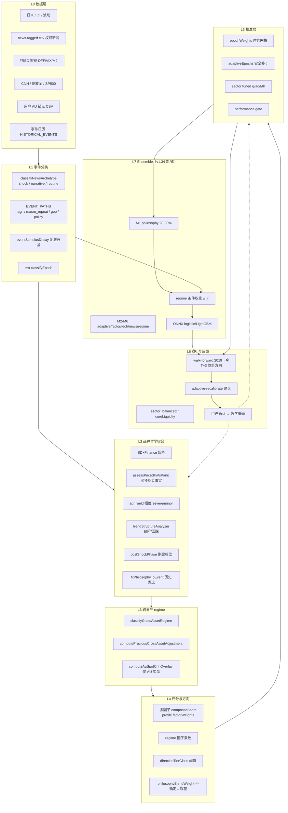
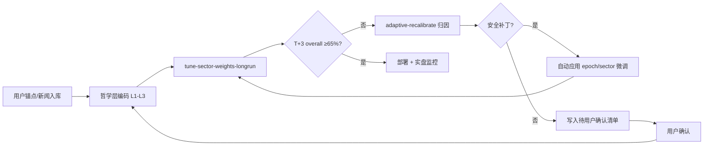

# 梵澄金融 · 大宗走势研判逻辑框架

> **版本**：v1.34 方向 · **哲学层** v1.32.3（待降为 M1） · **生成/更新**：2026-06-12  
> **目的**：用户架构决策已锁定；本文档描述 v1.34 目标架构与逻辑分层。  
> **数据根**：`FANCHENG_DATA_DRIVE=E` → `E:\FanchengFinance\data`  
> **配套**：[架构反思 §G](./FANCHENG_ARCHITECTURE_REFLECTION.md) · [数据层蓝图](./FANCHENG_DATA_LAYER_BLUEPRINT.md) · [v1.34 路线图](./FANCHENG_V134_ROADMAP.md)

---

## 一、现状快照与 v1.34 目标

| 指标 | 当前基线（T+1 · v1.32.3） | v1.34 目标 | 差距 |
|------|---------------------------|------------|------|
| 全量 overall | **55–56%** | T+3 方向 **65–68%** | 口径切换 + ~10pp |
| 核心流动性 overall | **56%** | T+3 ≥ **65%** | ~9pp |
| 贵金属 precious | **51–52%** | T+3 ≥ **58%** | ~7pp |
| 2025_2026 时代 | **51.9%** | T+3 ≥ **60%** | 数据+标签优先 |

**结论**：T+1 55–57% 平台期确认；v1.34 **不继续以 T+1 70% 为优化目标**。哲学层降为 **M1（20–30%）**，增益路径 = **标签 redesign + P0 数据 + L1 regime + L2 ONNX ensemble**。

---

## 二、核心原则（8 条）

1. **价格 = 供需 × 金融环境**  
   主矛盾（供需状态）与次矛盾（美元/Fed/中国政策/地缘）分级；二者通过 SD×Finance 矩阵合成基础方向分。

2. **事件有记忆，刺激会衰减**  
   同类宏观/地缘 headline 在 12 个月内第 N 次出现，冲击乘数递减（1.0 → 0.7 → 0.5 → …）。Fed 降息、霍尔木兹、关税均属 `macro_repeat` / `geo_escalation` 路径。

3. **买预期，卖事实——但分时代、分品种**  
   - **AU/AG**：降息预期阶段偏多；FOMC 落地若 T-5 已预涨 + 宽松资讯密集 → `priced_in` 弱化或翻空。  
   - **era_split**：`2019–2024` 可强 flip 偏空；`2025_2026` **仅观望 neutral、不翻空**（用户已确认）。  
   - **农产品例外**：轻微减产 = 利好兑现偏空；巨大/确定性减产 = 恐慌延续偏多（不走卖事实 flip）。

4. **趋势如行军——台阶、回踩、突破**  
   单边市以 pivot 台阶描述攻防；主矛盾定方向后，须结构确认（同向台阶或回踩后突破）才给高星/强方向。剧震后 `pullback` 相位降权，贵金属惩罚轻于能化。

5. **事件 vs 叙事——时间尺度不同**  
   - **shock_event**：T+1~T+5 剧烈，冲击后 5–20 日回撤/反弹。  
   - **narrative_theme**：T+20~T+60 缓慢抬升，CU/AL/AU/AG 叙事延长封顶（板块各异）。

6. **跨资产按 regime 动态，非固定负相关**  
   油金约 67% 交易日弱相关/脱钩；仅 ~28% 日落在可交易 regime（股金同步、避险同步、通胀油压等）。**2026-01-28** 后进入 `macro_regime_shift`，弱化「油涨压金」链条。

7. **沪金实操：国际金定方向 + CNH 溢价辅证**  
   以伦敦金/国际现货 5d 方向为门控；溢价走阔/CNH 变动仅在国际金同向时微调 AU，**不单独叠方向分**。回测默认跳过 overlay（数据代理噪声大）。

8. **市场逻辑会变——epoch 权重 + 反测闭环，非一套到底**  
   全局板块权重 × 时代网格 × adaptive 安全补丁；时代命中率低于全量 5pp 则 performance gate 下调哲学分权。用户锚点事件优先于泛化规则。

9. **v1.34：数据与标签优先于模型复杂度**  
   70% 量级增益来自 P0 数据（OI、term structure、库存）+ T+3 标签 + 事件窗口，而非更深网络。

10. **v1.34：哲学降为 M1，ensemble 动态融合**  
    `philosophyScore` 权重上限 20–30%；L2 按 L1 五态 regime 分配 M1–M6 权重；UI 仍展示 `logicSummary`。

---

## 三、六层架构



**数据流摘要**：L0 输入 → L1 事件分类 → L2 哲学（**M1 输出**）→ L3 跨资产 → L4 多因子 composite → L5 时代/板块校准 → **L7 regime ensemble** → L6 **T+3** walk-forward 评 KPI。

---

## 四、各品种规则矩阵

### 4.1 贵金属 AU / AG

| 维度 | 规则 | 参数/路径 |
|------|------|-----------|
| 宏观 Fed | 降息预期 → 偏多；落地 priced_in | `assessMacroFedPricedIn` |
| 时代 split | 2023_2024 首降可卖事实；2025_2026 不翻空 | `directionFlip=neutral` |
| 刺激衰减 | 同周期第 2/3 次降息弱化 | `STIMULUS_DECAY_SCHEDULE` · `macroRepeat` |
| 地缘 | 避险偏多；冲高后鹰派 hold → `hawkishHoldPostGeo` flip | 2026-03 用户锚点 |
| 跨资产 | regime 条件化 ±0.03~0.22；脱钩日零调整 | `commodity-cross-asset-regime` |
| 沪金 overlay | 国际金门控 + 溢价/CNH 辅证 | 回测 `skipAuSpotCnh=true` |
| 剧震回调 | pullback ×0.88（软于能化 0.78） | `post_shock_pullback` |
| 叙事延长 | cap 1.15–1.25 | `narrativeExtendCap` |

### 4.2 农产品（C / M / SR / CF / A / RM / P…）

| 维度 | 规则 | 与工业金属差异 |
|------|------|----------------|
| 事件路径 | `agri_climate_yield` / `agri_export_policy` | **不用** CU/SC 地缘衰减模板 |
| 轻微减产 | 预涨后落地 → flip 偏空 | `agri_minor_yield_priced_in` ×0.76~0.8 |
| 巨大减产 | 禁令/绝收/≥16% → 恐慌延续偏多 | `agri_confirmed_shortage_panic` ×1.10~1.14 |
| 谣言阶段 | 预涨 + 传闻 → 温和弱化，不翻空 | `agri_expectation_priced_in` |
| 天气 | 赌最终产量/收成 | `yield_outcome×1.1` |
| 主矛盾 | 气候/产量 > 金融 | `weather` 权重 0.30 |

### 4.3 能化 SC / FU / LU / BU / EC

| 维度 | 规则 |
|------|------|
| 地缘 | 俄乌/红海/霍尔木兹首冲击有效；重复 headline 衰减 `geo_repeat×0.78~0.88` |
| 剧震 | T+5 常 ≥10%；峰值后深度 pullback ×0.78 |
| 原油之母 | 能化链 spillover 至化工/部分黑色 |
| 2025 关税 | 需求担忧 → SC 持续承压（用户锚点） |
| 跨资产 | 2026-01-28 后与贵金属脱钩，勿固定油金负相关 |

### 4.4 有色 CU / AL / ZN / NI…

| 维度 | 规则 |
|------|------|
| 叙事 | AI/数据中心铜需求 → `narrative_theme` ×1.18，延长 cap 1.25 |
| 政策 | 供给侧改革、反内卷 → 偏多 |
| priced_in | 叙事预涨 → 震荡弱化 ×0.92，**不**强 flip |
| 库存 | LME/COMEX 库存 + OI 因子权重高 |
| 关税冲击 | 短期震荡，T+20 工业金属分化 |

### 4.5 黑色 RB / HC / I / J / JM…

| 维度 | 规则 |
|------|------|
| 主矛盾 | 中国宏观 + 基建地产链 >> 美元 |
| 政策 | 反内卷、产能淘汰、煤矿安全 → 供给收缩叙事 |
| 季节 | 冬储/开工率；气候灾害（洪涝→煤矿物流） |
| 矩阵弱格 | `supplyStrong×loose` 长周期仅 ~42%（待哲学验证） |

### 4.6 化工 TA / MA / FG / SA…

| 维度 | 规则 |
|------|------|
| 链条 | 原油引领 + 自身供需（玻璃/纯碱反内卷） |
| 表现 | 当前板块最接近 70%（~58%），逻辑相对稳 |
| 风险 | 过度依赖 epoch 权重掩盖品种特异（FG/ps） |

---

## 五、时代（Epoch）权重策略

### 5.1 时代分段（与回测一致）

| Era ID | 区间 | 市场特征 | 哲学侧重 |
|--------|------|----------|----------|
| `2019` | 2019 | 贸易战/疫前 | 关税 shock；油金负相关较强 |
| `2020_covid` | 2020 | 疫情流动性 | 双杀 `dual_risk_off`；Fed 大放水 |
| `2021` | 2021 | 复苏 | 需求反弹；品种分化 |
| `2022_hike_ru` | 2022 | 加息+俄乌 | 能源剧震；油金短期同向 |
| `2023_2024` | 2023–2024 | 高利率/BOJ | priced_in 卖事实；AI 叙事 |
| `2025_2026` | 2025– | 关税/伊朗/脱钩 | 哲学 gate↓；PM 不翻空；`macro_regime_shift` |

### 5.2 权重混合公式（概念）

```
effectiveWeight = globalSectorWeight
  × epochGridWeight[eraId]          // longrun 网格搜索
  × adaptiveMultiplier[eraId]       // 安全补丁，如 2025_2026 ×0.92
  × performanceGate[eraId]          // 时代 hit < 全量−5pp → 再下调
```

### 5.3 Adaptive 已应用 / 待确认

| 补丁 | 状态 | 说明 |
|------|------|------|
| `epoch-2025_2026-philosophy-gate` | ✅ 已应用 | φ 0.6→0.54 |
| `precious-priced-in-soften` | ✅ 已应用 | 卖事实 0.7→0.85 |
| `oil-gold-decouple-post-2026` | ✅ 已应用 | 油压金 1.0→0.35 |
| `matrix-supplyStrong×loose` | ⏳ 待确认 | 矩阵格 42% 命中率 |
| `inst-wr` / `inst-ao` | ⏳ 待确认 | 低流动性品种阈值 |

---

## 六、数据输入规范

### 6.1 权威新闻库 `news-tagged.csv`

| 字段 | 要求 |
|------|------|
| `date` | YYYY-MM-DD，FOMC 用**声明日**（非生效日） |
| `title` / `notes` | 含 `[philosophy:shock_event\|macro_repeat\|geo_escalation]` 标签 |
| `commodity_tags` | 关联合约或板块 |
| `direction` | bullish / bearish / neutral |
| **行数口径** | **358 行**（batch8 校验后权威库）；longrun 必须用此库 |

**快讯 inbox**：`flash-news-inbox.json` 抓取候选 **≠** 已标注新闻；合并须 `validate-and-dedupe-news.js --merge --flash` 且人工核验。**禁止**把 inbox 条数（数百~上千）与 tagged 行数混谈。

### 6.2 用户 AU 锚点（28+ 事件，batch1–5）

| 文件 | 用途 |
|------|------|
| `user-au-events-batch1.csv` … `batch5.csv` | FOMC / 地缘 / 银行危机等沪金实操锚点 |
| `user-au-events-pending.csv` | 待并入 |

**规范**：
- 周末事件对齐沪金**下一交易日**（如 10/7 巴以 → 10/9）
- 须最终 merge 进 `news-tagged.csv` 或引擎可读注解，否则 walk-forward 漏日
- 2026-03 美以袭伊、3/18 鹰派暂停为 **hawkishHoldPostGeo** 关键验证点

### 6.3 汇率与金价

| 序列 | 路径 | 用途 |
|------|------|------|
| 伦敦金 | `fred-london-gold-daily.json` | AU 国际方向门控 |
| CNH | `cnh-midrate-daily.json`（Eastmoney 收盘代理） | 溢价计算；**非** CFETS 中间价 |
| 在岸代理 | `fred-dexchus-daily.json` | 可选，标注「用在岸」 |

**溢价公式**：`溢价% = (AU×31.1035/CNH)/伦敦金 − 1`

### 6.4 行情与宏观

| 数据 | 路径 | 用途 |
|------|------|------|
| 74 合约日 K | `data/history/trading/{id}.json` | walk-forward 主样本 |
| FRED DFF 等 | `data/history/fred-*.json` | 金融环境 loose/tight |
| SP500 | `klines/index-sp500-day.json` | 跨资产 regime |

---

## 七、KPI 定义与回测闭环（v1.34）

### 7.1 计分口径

| KPI | 定义 | 用途 |
|-----|------|------|
| **overall_t3** | 74 品种 **T+3 趋势方向**命中率 | **v1.34 主 KPI** |
| **coreOverall_t3** | 排除 pt/pd/wr 后的 T+3 overall | 核心流动性计分 |
| **sector_balanced_t3** | 六板块 T+3 各 ≥58%（整体目标 65–68%） | 板块均衡 |
| overall_t1 | T+1 方向（legacy） | 对照/诊断 only |
| **byRegime** | L1 五态分 regime T+3 命中率 | ensemble 权重训练 |
| **byEra** | 分时代 T+3 命中率 | performance gate |
| **byMatrix** | SD×Finance 九格 | 哲学矩阵验证 |

标签实现：`services/outlook-labels.js` → `computeT3TrendDirection()`

### 7.2 闭环流程



**命令**（Phase 0 标签集成后）：
```bash
FANCHENG_DATA_DRIVE=E node scripts/tune-sector-weights-longrun.js --force --horizon=t3
FANCHENG_DATA_DRIVE=E node scripts/adaptive-recalibrate.js
```

---

## 七点五、L1 五态 Regime（v1.34）

| Regime | 中文 | 融合侧重 |
|--------|------|----------|
| `trend` | 趋势市 | M4 technical + momentum ↑ |
| `range` | 震荡市 | M3 factor mean-reversion ↑；M1 ↓ |
| `event` | 高波动事件市 | M5 news-shock ↑；M1 20% 上限 |
| `seasonal` | 季节性主导 | 农产品 M1 规则 + 季节因子 |
| `basis` | 基差修复市 | term structure 数据就绪后激活 |

实现：`services/market-regime-classifier.js`

---

## 八、已发现的逻辑冲突 / 漏洞（非代码 bug）

| # | 冲突 | 现象 | 建议处理 |
|---|------|------|----------|
| 1 | **探针 vs longrun 样本不一致** | 探针常用 2023–2026 AU 子集（~363 日）；longrun 为 2019+ 全品种（~17000 样本）。探针 +0.5pp 不等于 longrun 提升。 | 任何规则变更须用**同一 longrun 命令**验证；探针仅作方向性快检。 |
| 2 | **first-cut flip 回归** | `2024-09-18` 首降锚点：全局 first-era-cut bearish flip 误伤 2025 FOMC 样本；ablation 显示 anchor-only 优于 all-flip。 | 首降 flip **仅限有用户锚点证实的日期**；2025_2026 维持不翻空。 |
| 3 | **CNH overlay 误规格** | 修复前 overlay 使 AU 探针 **−8.2pp**；修复后门控后 ≈0pp，但 spot 代理噪声仍在。 | 回测继续 skip；实盘展示 rationale；待 CFETS 历史或用户 CSV 再启用回测 overlay。 |
| 4 | **新闻 358 vs 快讯 1147 混淆** | `news-tagged` **358 行**是权威标注库；flash inbox / 抓取候选可达 **数百~上千**，未标注、未合并。 | KPI 报告须注明 `newsTagged.getRowCount()`；合并前禁止用 inbox 条数评估哲学。 |
| 5 | **油金相关时代漂移** | 2019 AU-SC corr≈−0.22；2022 同向 +0.27；2026 分化。固定 `inflation_oil_drag` 误杀 AU。 | 已编码 `macro_regime_shift`；须用户确认 2026-01-28 是否为永久分界。 |
| 6 | **priced_in 与 repeat 衰减打架** | 2025_2026 三次降息：repeat 弱化 vs priced_in 不翻空 vs hawkishHoldPostGeo 翻空——边界日易误判。 | 明确优先级：**用户锚点 > hawkishHoldPostGeo > era_split 不翻空 > repeat 衰减**。 |
| 7 | **矩阵格 supplyStrong×loose** | 长周期 **42%**，远低于均值。 | 待用户决定：观望规则 vs 下调该格哲学权重 vs 拆分品种。 |
| 8 | **哲学迭代反向拖累** | v1.29 57% → v1.31–v1.32 56% → anchor-fix 55%。部分「锲合」规则样本外有害。 | 新规则须通过 **ablation + 锚点日 trace** 再并入 longrun。 |

---

## 九、已锁定决策（2026-06-12）

| ID | 决策 | 状态 |
|----|------|------|
| **D1** | KPI = **T+3 趋势方向**，目标 65–68% | ✅ 已锁定 |
| **D2** | 哲学 = **M1 子模型** 20–30% | ✅ 已锁定 |
| **D3** | Electron 允许 **onnxruntime-node** | ✅ 已锁定 |
| D4 | 2026-01-28 油金脱钩永久分界 | ⏳ 仍待确认 |
| D5 | AU CNH overlay 回测 skip | ⏳ 仍待确认 |
| D6 | AU 锚点 merge 进 news-tagged | ⏳ Phase 1 P0 |
| D7 | flash 人工审核入库 | ⏳ 仍待确认 |
| D8 | supplyStrong×loose 矩阵格 | ⏳ 仍待确认 |

详见 [FANCHENG_ARCHITECTURE_REFLECTION.md §G](./FANCHENG_ARCHITECTURE_REFLECTION.md)

---

## 十、v1.34 执行约束

在 **Phase 0 标签集成** 完成前：

1. ❌ 并行启动多条 longrun 网格搜索
2. ❌ 以 T+1 70% 为目标调 philosophy 权重
3. ❌ 将 flash inbox 未审核条目标注进回测
4. ❌ 跳过 Phase 1 P0 数据直接训练 LightGBM

**下一步**（见 [FANCHENG_V134_ROADMAP.md](./FANCHENG_V134_ROADMAP.md)）：

1. Phase 0：`outlook-labels.js` 集成 backtest
2. Phase 1：P0 数据（OI · term structure · 库存 · 新闻 merge）
3. Phase 2：`market-regime-classifier.js` 日频标签
4. Phase 3：L2 ONNX ensemble，M1=哲学

---

## 十一、关键模块索引

| 层级 | 文件 |
|------|------|
| L1–L2 | `services/commodity-outlook-philosophy.js` |
| L3 | `services/commodity-cross-asset-regime.js` |
| L4 | `services/commodity-outlook-engine.js` |
| L4 阈值 | `services/commodity-instrument-profiles.js` |
| L5 | `services/commodity-outlook-calibration.js` · `services/outlook-adaptive-calibration.js` |
| L6 | `services/commodity-outlook-backtest.js` · `scripts/tune-sector-weights-longrun.js` |
| L7 | `services/outlook-labels.js` · `services/market-regime-classifier.js` · `outlook-ensemble.js`（待建） |
| 时代 | `services/commodity-outlook-event-calendar.js` |
| 文档 | `docs/FANCHENG_*.md` · `docs/PHILOSOPHY_*.md` · `docs/ADAPTIVE_CALIBRATION.md` |

---

*本文档为 v1.34 逻辑框架。架构 Q1–Q3 已锁定；按路线图分 Phase 工程化。*
