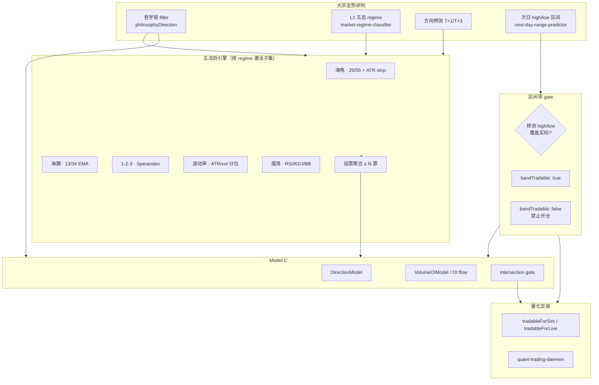

# 大宗走势研判 · 五法则集成规格

> **版本**：v0.1（用户确认版） · **锁定日期**：2026-06-17  
> **状态**：架构决策已确认 · **生产代码/权重不变**（当前 `v1.34.8-ag-cu-spread+basis-term`）  
> **配套**：[哲学过滤器架构](./PHILOSOPHY_FILTER_ARCHITECTURE.md) · [量化交易模块](./QUANT_TRADING.md) · [逻辑框架](./FANCHENG_LOGIC_FRAMEWORK.md) · [T1 统一管线](./T1_UNIFIED_PIPELINE.md)

---

## 一、背景与目标

### 1.1 范围界定

**大宗走势研判** = 桌面端「大宗走势」页内 **除「量化交易」标签外** 的全部研判能力（方向预测、次日 high/low 区间、哲学层、regime、跨境传导等）。

**目标**：在现有哲学层 + ML 方向预测之上，引入 **五法则** 技术确认层，提高大宗商品预测准确率；**次日 high/low 目标位** 为 live 量化交易的前置条件（区间带可交易性 gate）。

### 1.2 五法则一览

| # | 法则 | 类型 | 简述 |
|---|------|------|------|
| 1 | **海龟** | 趋势 | 20/55 日突破 + ATR(20) 止损 |
| 2 | **海豚** | 趋势 | 13/34 EMA 金叉/死叉；贵金属 CMX 领先、国内跟腿 |
| 3 | **1-2-3** | 趋势/反转 | Victor Sperandeo 反转结构；确认后于 **突破点 2** 入场 |
| 4 | **波动率** | 环境 | ATR / 20 日 realized vol 分位；低波等突破、高波减仓或观望 |
| 5 | **摆荡** | 震荡 | RSI / KDJ / 布林带；周期 14/20 |

**Regime 分流（用户确认）**：

- **趋势类** → 海龟 + 海豚 + 1-2-3  
- **震荡类** → 摆荡 + 波动率  

---

## 二、端到端管线（Mermaid）



**决策顺序**：研判方向与哲学 filter → 五法则按 regime 计票 → 区间带可交易性 → Model C 方向∩OI 交集 → 量化 daemon 执行。

---

## 三、L1 五态 Regime → 五法则映射

现有分类器：`services/market-regime-classifier.js` → `classifyMarketRegime()`（五态：`trend` / `range` / `event` / `seasonal` / `basis`）。

**是否一一对应？** 否。五法则的「趋势/震荡」二分与 L1 五态 **非严格同构**；下表为 **提议映射**（实现前须 walk-forward 探针校验）。

| L1 Regime | 中文 | 激活法则 | 权重 / 备注 |
|-----------|------|----------|-------------|
| **`trend`** | 趋势市 | 海龟 + 海豚 + 1-2-3 + 波动率（辅助） | 趋势三法则 **满权重**；波动率仅作仓位/观望调节 |
| **`range`** | 震荡市 | 摆荡 + 波动率 | **摆荡权重最高**；趋势三法则 **禁用** |
| **`event`** | 高波动事件市 | 海龟 + 1-2-3（**子集**）+ 波动率 | **谨慎模式**：趋势法则降权或仅作方向确认；**禁止逆势摆荡**；高 vol → 减仓/观望 |
| **`basis`** | 基差修复市 | 海龟 + 摆荡 + 波动率（**混合**） | **TBD** — 基差修复兼具趋势与均值回归；待 term-structure 样本充足后定权 |
| **`seasonal`** | 季节性主导 | 同 `range` 或农产品特例 | **TBD** — 建议农产品 planting/harvest 窗口偏向摆荡；非农产品回退 `trend` 子集 |

### 3.1 跨 Regime 硬规则

| 规则 | 说明 |
|------|------|
| **趋势日禁逆势摆荡** | 当 `regime === 'trend'` 且海龟/海豚/1-2-3 多数同向时，**摆荡法则不得给出反向开仓票** |
| **range 日禁纯趋势追单** | `regime === 'range'` 时海龟/海豚/1-2-3 **不参与计票**（输出 `inactive`） |
| **event 日仓位上限** | 波动率分位 > 高阈值时，即使其它 gate 通过，**强制观望或减半仓位** |

---

## 四、各法则参数摘要

### 4.1 海龟（Trend）

| 参数 | 值 | 说明 |
|------|-----|------|
| 入场通道 | **20 日** / **55 日** 突破 | 短周期先行、长周期确认（经典 Turtle 双系统） |
| 止损 | **ATR(20)** | 突破反向穿越或 ATR 倍数止损 |
| 频次 | **每品种每日最多 1 次往返** | **禁止加仓/金字塔**（no pyramiding） |
| 方向票 | 突破方向与研判方向一致 → +1 票 | 不一致 → 0 票（或 veto，待探针） |

### 4.2 海豚（Trend · EMA Cross）

| 参数 | 值 | 说明 |
|------|-----|------|
| 均线 | **EMA(13)** × **EMA(34)** | 金叉/死叉定方向 |
| 贵金属 lead | **CMX 金/银领先，AU/AG 跟腿** | 国内信号须 CMX 同向或已确认传导后计票 |
| 适用 regime | `trend` · `event`（降权） | `range` 不激活 |

### 4.3 1-2-3（Victor Sperandeo 反转）

| 参数 | 值 | 说明 |
|------|-----|------|
| 结构 | 点 1（极值）→ 点 2（反弹/回调）→ 点 3（再测不破） | 经典 1-2-3 反转 |
| 入场 | **确认后于突破点 2 价位** | 非点 3 追单 |
| 方向票 | 结构与研判方向一致且点 2 已突破 → +1 票 | 未完成结构 → 不计票 |

### 4.4 波动率（Volatility Regime）

| 参数 | 值 | 说明 |
|------|-----|------|
| 指标 | **ATR** + **20 日 realized vol 分位数** | 双指标交叉验证 |
| 低 vol | 分位 < 低阈值 | **等待突破**，不强行开仓；趋势法则权重可下调 |
| 高 vol | 分位 > 高阈值 | **减仓或观望**；event 日强制生效 |
| **明确排除** | **不** 接入 `next-day-range-predictor` 的 `upMult` / `downMult` | 区间宽度乘数与波动率法则 **解耦**（当前阶段） |

### 4.5 摆荡（Oscillation · Range）

| 参数 | 值 | 说明 |
|------|-----|------|
| 指标 | **RSI** · **KDJ** · **Bollinger Bands** | 三指标投票（各 0/1） |
| 周期 | **14** / **20** | RSI(14)、BB(20)、KDJ 默认 (9,3,3) 可探针网格 |
| 最高权重 regime | **`range`** | 震荡日摆荡票权重 × `rangeOscWeight`（建议初始 1.5） |
| 趋势日 | **禁用逆势摆荡交易** | 见 §3.1 |

---

## 五、次日 High/Low = 目标位（区间带 Gate）

### 5.1 语义

- `predHigh` / `predLow`（`next-day-range-predictor.js`）= **下一交易日目标位**，非单纯置信区间装饰。  
- 预测锚定 **baselineDate 日 15:00 昨收**；覆盖窗口 = T 日 21:00 夜盘 → T+1 日 15:00 日盘（与现有 CN session 口径一致）。

### 5.2 可交易性判定

| 场景 | 条件 | `bandTradable` | sim_relaxed | sim_balanced / live |
|------|------|----------------|-------------|---------------------|
| **带内覆盖** | 实际 high ≤ predHigh **且** 实际 low ≥ predLow | `true` | 允许 · 1.0× | 允许 |
| **带未覆盖（band miss）** | 任一侧突破预测带 | `false` | **软放行** 0.6× · `bandSoftPass` | **禁止开仓** |
| **部分命中** | 仅 high 或 low 一侧命中 | `false` | `partial` 模式 0.75×（探针与 soft 等效） | **禁止开仓** |
| **预测日（T 日收盘后）** | 尚无 actual | `pending` | 不挡 sim | live **必须 true** |

**用户确认（2026-06-18）**：

- **live_high_hit / sim_balanced**：预测 high/low **未能覆盖** 实际 → **禁止开仓**（硬 gate）。
- **sim_relaxed**：band miss **不阻断** sim；缩仓至 **0.6×** 并标记 `bandSoftPass=true`。环境变量 `QUANT_BAND_SIM_MODE=soft|partial|off|strict`（默认 `soft`）。

### 5.2.1 存档字段

成交 / gate 输出扩展：`bandGateMode` · `bandSoftPass` · `bandBlocked` · `liveBandBlocked`

### 5.3 与现有审计存档对齐

复用 `range-prediction-archive` schema 字段：`highHit` · `lowHit` · `bandHit`（见 [PROJECT_RECOVERY_STATUS.md](./PROJECT_RECOVERY_STATUS.md) §区间预测对比）。  
Quant Gate 读取 **前一日** 对 **当日 session** 的 `bandHit`（或 T 日对 T+1 的 pred 在 T+1 收盘后回填判定）。

---

## 六、Quant Gate（量化放行条件）

**用户确认**：以下 **全部为必要条件**（AND），任一失败 → `tradableSignal = false`。

1. **研判方向** — `philosophyDirection` 非 neutral 且 `filterPass === true`  
2. **五法则投票** — 激活法则中 ≥ **N** 票与研判方向同向（N 待 walk-forward，建议初始 N=2）  
3. **区间带可交易** — live/sim_balanced：`bandTradable === true`；sim_relaxed：miss 软放行（见 §5.2）  
4. **Model C / OI** — DirectionModel 与 VolumeOIModel 同向，且满足 flow 阈值（见 [PHILOSOPHY_FILTER_ARCHITECTURE.md](./PHILOSOPHY_FILTER_ARCHITECTURE.md) §5）

### 6.1 伪代码

```
function evaluateQuantGate(ctx) {
  const {
    philosophyDirection, filterPass,
    regime, lawVotes,           // { turtle, dolphin, oneTwoThree, volatility, oscillation } → 'long'|'short'|'neutral'|'inactive'
    bandTradable,               // true | false | 'pending'
    dirModel, flowModel,
    tier                        // 'sim_balanced' | 'live_high_hit'
  } = ctx;

  const reasons = [];

  if (!filterPass || philosophyDirection === 'neutral') {
    reasons.push('philosophy_filter_fail');
    return { tradable: false, reasons };
  }

  const activeLaws = lawVotes.filter(v => v.state !== 'inactive');
  const aligned = activeLaws.filter(v => v.direction === philosophyDirection);
  const N = ctx.lawVoteThreshold ?? 2;

  if (aligned.length < N) {
    reasons.push(`law_votes_insufficient:${aligned.length}/${N}`);
    return { tradable: false, reasons };
  }

  if (tier === 'live_high_hit') {
    if (bandTradable !== true) {
      reasons.push(bandTradable === false ? 'band_miss_no_trade' : 'band_pending');
      return { tradable: false, reasons };
    }
  } else {
    // sim_balanced：band miss 仍禁止开仓
    if (bandTradable === false) {
      reasons.push('band_miss_no_trade');
      return { tradable: false, reasons };
    }
  }
  // sim_relaxed：band miss → bandSoftPass + sizeMultiplier *= 0.6（不 return false）

  if (dirModel.direction !== philosophyDirection ||
      flowModel.direction !== philosophyDirection) {
    reasons.push('model_c_intersection_fail');
    return { tradable: false, reasons };
  }

  if (!flowModel.meetsThreshold) {
    reasons.push('oi_flow_threshold_fail');
    return { tradable: false, reasons };
  }

  // 波动率 high → 减仓标记（仍 tradable，但 quant 模块缩仓）
  const sizeMultiplier = ctx.volatilityRegime === 'high' ? 0.5 : 1.0;

  return {
    tradable: true,
    reasons: [],
    sizeMultiplier,
    lawVoteCount: aligned.length
  };
}
```

### 6.2 与现有 Model C tier 的关系

| Tier | 五法则 | 区间带 | 说明 |
|------|--------|--------|------|
| `sim_relaxed` | 软 gate（计分缩仓） | miss → **软放行 0.6×** | 回测 / daemon 默认 |
| `sim_balanced` | ≥ N 票 | miss → 禁止开仓 | 较严探针对照 |
| `live_high_hit` | ≥ N 票（可 N+1 更严） | **必须 bandHit** | UI「可交易」徽章 |

现有 `services/model-c-live-strategy.js` 阈值 **保留**；五法则 gate **叠加** 而非替换哲学/flow 条件。

---

## 七、板块差异

**用户决定：暂缓（先慢点讨论）。**

规格占位：贵金属（CMX lead）、有色（LME lead）、黑色/化工/农产品 **分板块 N 阈值 / 法则权重** 不在 v0.1 实现范围；Phase 1 探针统一用全局 N=2，后续按 sector manifest 扩展。

---

## 八、实现分期

### Phase 1 — 服务层 + 探针（无 UI）

| 交付 | 说明 | 状态 |
|------|------|------|
| `services/trading-rules-five-laws.js` | 单品种单日五法则计票；输入 OHLCV + regime + lead 市场 | ✅ 已实现 |
| `services/trading-rules-quant-gate.js` | §6 伪代码落地；输出 `tradableSignal` / `neutralReason[]` | ✅ 已实现 |
| `scripts/probe-five-laws-quant-gate.js` | walk-forward：law 命中率、band miss 率、与 Model C 交集 KPI | ✅ 已实现 |
| Simulator + Daemon 接入 | `quant-trading-simulator.js` · `quant-trading-daemon.js` | ✅ 已接入 |
| Archive 扩展 | direction-prediction-archive v2 增加 `lawVotes` · `bandTradable` · `quantGatePass` 字段（只写 probe，不改生产路径） | 待 Phase 2 |

**退出条件**：探针报告 `_probe-five-laws-quant-gate-summary.json`；sim_relaxed band miss 软放行回溯正确；live_high_hit band miss **零开仓**。

**已锁定投票阈值（2026-06-18）**：

| Regime | sim_relaxed | sim_balanced | live_high_hit |
|--------|-------------|--------------|---------------|
| trend | ≥1 of 3 | ≥2 of 3 | ≥3 of 3 |
| event | ≥1 of 3（无强制 turtle/dolphin；近突破 0.5ATR + CMX EMA lead） | ≥2 of 3 + turtle\|dolphin | ≥2 of 3 + turtle\|dolphin + band 必须命中 |
| range | ≥1 of 2（高 vol 观望时禁止） | 2 of 2 | 2 of 2 |
| basis | ≥1 of 3 | ≥2 of 3 | ≥3 of 3 |

**event 软规则（sim tier）**：海龟近突破（距 20/55 通道 ≤0.5 ATR）计 0.5 票；贵金属 event 日海豚允许 CMX 13/34 EMA 领先腿单独计票（国内未金叉时）。

**sim_relaxed 硬/软 gate（2026-06-18）**：仿真放行要求哲学 filter + Model C tier + 区间带（**miss 软放行 0.6×**，`QUANT_BAND_SIM_MODE=soft`）；五法则 **不阻断** sim，按对齐度缩放仓位（pass=1.0×，部分=0.85×，零票=0.7×）。`live_high_hit` 仍须五法则硬 gate + band 硬阻断。

**探针 KPI（au/ag/rb 2023–2025，soft band）**：22 笔 · +3.55% · 73% vs 严格 band 15/+1.93%/67% vs Model C only 23/+4.38%。

### Phase 2 — 大宗走势研判 UI

| 交付 | 说明 |
|------|------|
| 品种卡片 | 五法则逐条状态 chip（多/空/中性/未激活） |
| 区间带 | 目标位 high/low 与 **bandTradable** 徽章 |
| Regime 联动 | 显示当前 regime 下激活法则子集 |
| 审计表 | 最近 N 日 law 投票 + bandHit 列 |

**退出条件**：UI 只读展示 probe 存档；**不改变** v1.34.8 生产权重。

### Phase 3 — 量化 Daemon 集成

| 交付 | 说明 |
|------|------|
| `scripts/quant-trading-daemon.js` | 读取 Quant Gate；band miss 日 skip |
| `services/quant-trading-margin.js` | 接入 `sizeMultiplier`（高 vol 减半） |
| 任务计划 | 15:05 评估 gate；20:55 执行前复检 bandTradable |
| 回测 | `run-quant-trading-backtest.js` 同步 gate 逻辑 |

**退出条件**：sim_balanced 回测可复现；live_high_hit 信号率 ≤ 当前 ~1–2% 且命中不降。

---

## 九、开放参数（待 walk-forward）

| 参数 | 候选 | 备注 |
|------|------|------|
| `lawVoteThreshold` (N) | 2, 3 | 激活法则数不足时 N 自适应下调 |
| `volatility.lowPctile` | 20, 30 | 低波等待突破 |
| `volatility.highPctile` | 70, 80 | 高波减仓/观望 |
| `rangeOscWeight` | 1.0, 1.5, 2.0 | range 日摆荡票权重 |
| `event.trendLawScale` | 0.3, 0.5, 1.0 | event 日趋势法则缩放 |
| `basis.mode` | — | **TBD** |

---

## 十、相关文件（实现时 touch）

| 模块 | 当前 | 目标变更 |
|------|------|----------|
| `services/market-regime-classifier.js` | L1 五态 | 导出 `activeLawSet(regime)` 映射表 |
| `services/next-day-range-predictor.js` | pred high/low | 输出 `bandTradable` 语义文档化；**不改** upMult/downMult |
| `services/model-c-intersection-gate.js` | 哲学∩dir∩flow | 接入五法则 + band gate |
| `services/commodity-outlook-engine.js` | 研判总线 | lazy require 五法则引擎 |
| `scripts/quant-trading-daemon.js` | Model C sim | Phase 3 接入 Quant Gate |

---

*用户架构确认 · 2026-06-17 · 实现前须重读本文与 [PHILOSOPHY_FILTER_ARCHITECTURE.md](./PHILOSOPHY_FILTER_ARCHITECTURE.md) gate 结论 · [QUANT_TRADING.md](./QUANT_TRADING.md) 交易规则*
